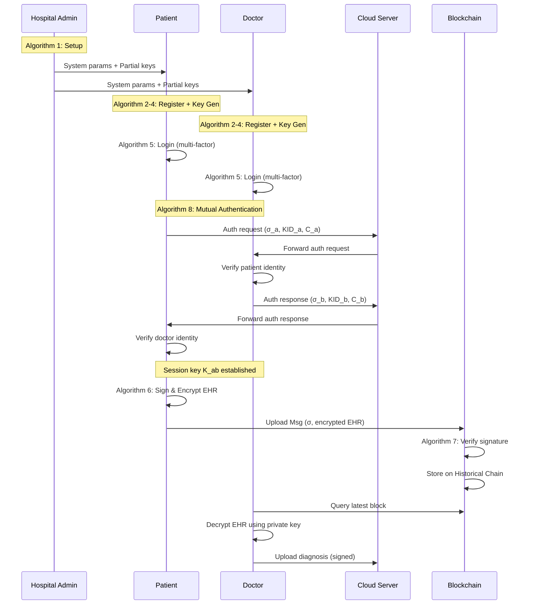

# Blockchain-Based Certificateless Anonymous Authentication for Healthcare EHR Sharing

## System Overview

A blockchain-based certificateless conditional anonymous authentication scheme for secure Electronic Health Record (EHR) sharing between **patients** and **doctors** in a Healthcare IoT environment.

---

## System Entities

| Entity | Role | Analogy (Original BCCA) |
|--------|------|------------------------|
| **Hospital Admin (HA)** | Trusted authority; generates system parameters, partial private keys, manages revocation | PKG |
| **Patient (P_a)** | Collects health data via wearable sensors; uploads encrypted EHR to blockchain | User / Data Producer |
| **Doctor (D_b)** | Requests and accesses patient EHR; provides diagnosis | Task Publisher / Data Consumer |
| **Cloud Server** | Stores encrypted EHR files; mediates patient-doctor communication | — |
| **Blockchain Nodes** | Consensus servers; verify signatures and maintain the dual-chain ledger | Consensus Server VS_i |
| **Historical Chain** | Stores verified EHR signature records for auditability | Historical Chain |
| **Evidence Chain** | Stores revocation evidence for malicious users (modifiable via Chameleon Hash) | Evidence Chain |

---

## System Flow



---

## Algorithm 1: System Setup

**Executor:** Hospital Admin (HA)

**Input:** Security parameter κ

**Process:**
1. HA selects an elliptic curve **E** over a finite field **Z_p**, and chooses an additive group **G** with order **q** and generator **P**.
2. HA randomly chooses **s ∈ Z\*_q** as the master key.

### CLA-Based Public Key Splitting (A = s, B = P_x)
3. Let **P_x = x-coordinate(P) mod q**.
4. Compute:
   - **Generate:** G_cla = (s · P_x) mod q
   - **Propagate:** Prop = (s ⊕ P_x) mod q
5. Derive two master scalars:
   - **s₁ = G_cla = (s · P_x) mod q**
   - **s₂ = (G_cla + Prop) mod q**
6. Compute the **split system public keys**:
   - **P_pub = s · P** (used in key verification and identity tracing)
   - **P_pub1 = s₁ · P** (used exclusively in H₂ for EHR integrity binding)
   - **P_pub2 = s₂ · P** (used exclusively in H₃ for temporal freshness binding)
7. HA generates a key pair for data decryption:
   - Private key **y ∈ Z\*_q** (given to authorized doctors)
   - Public key **dpk = y · P** (doctor's decryption public key, published)
8. HA defines three hash functions: **H_i : {0,1}\* → Z\*_q**, where i = 1, 2, 3.
9. HA publishes:
   **params = {E, G, q, P, P_pub, P_pub1, P_pub2, dpk, H₁, H₂, H₃}**

**Output:** params, master key s (secret)

---

## Algorithm 2: Patient/Doctor Registration

**Executor:** Patient P_a or Doctor D_b (generalized as user U_i)

**Input:** params, user personal details

**Process:**
1. U_i chooses **x_i ∈ Z\*_q** as secret key, computes **upk_i = x_i · P**.
2. U_i provides real identity **RID_i** (e.g., Aadhaar/SSN for patient, Medical License ID for doctor) and password **PW_i**:
   **UPW_i = H₁(RID_i, PW_i)**

### Deterministic BIO Factor (Replaces Fuzzy Extractor)
3. U_i provides personal details:
   - **For Patient:** Date of birth (DOB), blood group, emergency contact, security answer (SA)
   - **For Doctor:** Date of birth (DOB), medical registration number, security answer (SA)
4. Compute: **α_i = H₁(DOB_i, SA_i, OtherDetails_i)**

5. U_i sends **Reg_i = (upk_i, RID_i, UPW_i, α_i, Role_i)** to HA via a secure channel.
   - **Role_i ∈ {PATIENT, DOCTOR}** identifies the user's role for access control.

**Output:** Reg_i sent to HA

---

## Algorithm 3: Partial Private Key Extraction

**Executor:** Hospital Admin (HA)

**Input:** params, Reg_i

**Process:**
1. HA verifies the user's role and identity (e.g., checks medical license for doctors, hospital records for patients).
2. HA chooses **d_i ∈ Z\*_q**, computes **E_i = d_i · P** and **E\*_i = s · E_i**.
   Pseudonym: **ID_i = Enc_{E\*_{i,x}}(RID_i ‖ Role_i)**

> [!NOTE]
> The pseudonym now encodes both the real identity AND the role. This allows HA to trace not just who a malicious user is, but whether they are a patient or doctor.

3. HA chooses **k_i ∈ Z\*_q**, computes **gpk_i = k_i · P** and:
   **psk_i = k_i + s · h_{1,i}**, where **h_{1,i} = H₁(ID_i, gpk_i, upk_i, P_pub, E_i)**
4. HA computes login credentials:
   - **A_i = psk_i · UPW_i**
   - **B_i = H₁(α_i, UPW_i, psk_i)**
5. If **Role_i = DOCTOR**, HA also provides the decryption private key **y** (or a role-specific derivative) via a secure channel.
6. HA sends **{gpk_i, psk_i, E_i, ID_i, A_i, B_i}** to U_i.

**Output:** Partial key material + pseudonym

---

## Algorithm 4: Key Generation (with Full Precomputation)

**Executor:** Patient P_a or Doctor D_b

**Input:** params, partial key material, x_i

**Process:**

### Step 4.1 — Verify & Set Keys
1. Verify: **psk_i · P = gpk_i + h_{1,i} · P_pub**
2. Set **pk_i = {upk_i, gpk_i}** (public key), **sk_i = (x_i, psk_i)** (private key).

### Step 4.2 — Precompute SID/KID Sets
3. Choose **n** random **{v_{i,j}}**, compute:
   - **SID_{i,j} = (v_{i,j} · x_i + H₁(RID_i, α_i)) mod q**
   - **KID_{i,j} = SID_{i,j} · P**

### Step 4.3 — Precompute Encryption Set (For Patients uploading EHR)
4. Choose **n** random **{q_{i,j}}**, precompute:
   - **Q_{i,j} = q_{i,j} · P** (encryption commitment)
   - **ek_{i,j} = H₁(q_{i,j} · dpk)** (encryption key for EHR)

> [!TIP]
> **Doctors** may skip Step 4.3 if they only verify and decrypt EHR, not upload. However, doctors who upload diagnosis reports would also precompute their own encryption sets.

5. Store **{A_i, B_i, SID_i, KID_i, Q_i, ek_i}** in the user's device.

**Output:** Full key material + precomputed sets

---

## Algorithm 5: Login

**Executor:** Patient's wearable device or Doctor's workstation

**Input:** params, RID_i, PW_i, DOB_i, SA_i, OD_i

**Process:**
1. User provides credentials to their device.
2. Device computes:
   - **α_i = H₁(DOB_i, SA_i, OD_i)**
   - **UPW_i = H₁(RID_i, PW_i)**
   - **psk_i = A_i · UPW_i⁻¹**
3. Device checks: **B_i = H₁(α_i, UPW_i, psk_i)**
   - If valid → login granted ✓
   - Otherwise → login denied ✗

> [!NOTE]
> **Multifactor authentication** for healthcare:
> - **Something you know:** Password, DOB, Security Answer
> - **Something you have:** Device/smart card storing A_i, B_i
> - This replaces biometric hardware while maintaining strong authentication.

---

## Algorithm 6: EHR Upload (Sign & Encrypt)

**Executor:** Patient P_a

**Input:** params, EHR data m_i, sk_i, pk_i, ID_i, precomputed sets

**Process:**
1. Patient retrieves the k-th precomputed values: **SID_{i,k}**, **KID_{i,k}**, **Q_{i,k}**, **ek_{i,k}**.
2. Patient encrypts the EHR: **c_i = m_i ⊕ ek_{i,k}**

> [!NOTE]
> The EHR data m_i can include: vital signs (heart rate, BP, SpO2), lab reports, prescriptions, imaging data references, etc. The XOR encryption with ek_{i,k} = H₁(q_{i,k} · dpk) ensures only authorized doctors with the decryption key y can recover the plaintext.

3. Patient computes the two hash values with **domain-separated public keys**:
   - **h_{2,i} = H₂(ID_i, KID_{i,k}, Q_{i,k}, P_pub1)**
   - **h_{3,i} = H₃(c_i, pk_i, P_pub2, T_i)**, where T_i is the current timestamp
4. Patient computes the signature (**zero EC scalar multiplications**):
   **σ_i = psk_i + h_{2,i} · SID_{i,k} + h_{3,i} · x_i**
5. Patient sends:
   **EHR_Msg_i = {σ_i, ID_i, E_i, pk_i, KID_{i,k}, c_i, Q_{i,k}, T_i}**
   to blockchain nodes.

**Output:** Signed and encrypted EHR message

### EHR Upload Cost

| Operation | Count |
|-----------|:---:|
| EC Scalar Mult (T_Mu) | **0** |
| Hash Calls (T_ha) | 2 |
| Modular Mult (T_mu) | 2 |
| XOR (encryption) | 1 |

---

## Algorithm 7: EHR Verification & Access

**Executor:** Blockchain nodes (verify) + Doctor D_b (decrypt)

### Part A — Blockchain Verification

1. Node checks timestamp freshness: **|T_i − T_cur| ≤ ΔT**.
2. Node computes:
   - **h_{1,i} = H₁(ID_i, pk_i, P_pub, E_i)**
   - **h_{2,i} = H₂(ID_i, KID_{i,k}, Q_{i,k}, P_pub1)**
   - **h_{3,i} = H₃(c_i, pk_i, P_pub2, T_i)**
3. Node verifies:
   **σ_i · P = gpk_i + h_{1,i} · P_pub + h_{2,i} · KID_{i,k} + h_{3,i} · upk_i**
4. If valid → store EHR_Msg_i on the **Historical Chain**; otherwise → reject.

### Part B — Doctor Decryption

5. Authorized Doctor D_b queries the latest block for the patient's EHR.
6. Doctor decrypts the EHR:
   **m_i = c_i ⊕ H₁(y · Q_{i,k})**
   where y is the doctor's decryption private key.

### Part C — Batch Verification (for multiple EHR records)

For n EHR messages, choose λ_i ∈ [1, 2^t] and verify:
```
(Σ λ_i · σ_i) · P = Σ λ_i · gpk_i + Σ λ_i · h_{1,i} · P_pub
                   + Σ λ_i · h_{2,i} · KID_{i,k} + Σ λ_i · h_{3,i} · upk_i
```

---

## Algorithm 8: Mutual Patient-Doctor Authentication

Before sharing sensitive EHR, the patient and doctor authenticate each other's identity. This protocol uses the CLA-modified CLS scheme (from Paper 2 modifications).

**Additional hash functions for this protocol:**
- **H: G → Z\*_q** (symmetric key derivation)
- **H₅: {0,1}\* → Z\*_q** (session key derivation)

### Step 1 — Patient P_a Sends Authentication Request

1. Let **Time_a** be the current timestamp.
2. P_a retrieves precomputed **SID^a_k** and **KID^a_k**.
3. P_a computes the shared secret using the doctor's public parameters:
   - **W_a = SID^a_k · (X_b + R_b + h^b₁ · P_pub)**, where h^b₁ = H₁(ID_b, pk_b, P_pub, E_b)
   - **k_a = H(W_a)**
   - **C_a = Enc(k_a, KID^a_k ‖ ID_a ‖ Role_a ‖ Time_a)**
4. P_a computes the authentication signature:
   - **h^a₁ = H₁(ID_a, pk_a, P_pub, E_a)**
   - **h^a₂ = H₂(ID_a, KID^a_k, C_a, P_pub1)**
   - **h^a₃ = H₃(C_a, pk_a, P_pub2, Time_a)**
   - **σ_a = psk_a + h^a₂ · SID^a_k + h^a₃ · x_a**
5. P_a selects **z_a ∈ Z\*_q**, computes **Z_a = z_a · P**.
6. P_a sends **(Z_a, C_a, σ_a, KID^a_k, Time_a)** to cloud server.

### Step 2 — Doctor D_b Verifies Patient & Responds

1. D_b downloads **(Z_a, C_a, σ_a, KID^a_k, Time_a)** from cloud server.
2. Check timestamp freshness.
3. Compute: **W'_a = (x_b + d_b) · KID^a_k**
   - Equals W_a because: (x_b + d_b)·KID^a_k = SID^a_k·(X_b + R_b + h^b₁·P_pub)
4. Decrypt: **KID^a_k ‖ ID_a ‖ Role_a ‖ Time_a = Dec(H(W'_a), C_a)**
5. **Verify Role_a = PATIENT** (access control check).
6. Verify P_a's signature:
   **σ_a · P = gpk_a + h^a₁ · P_pub + h^a₂ · KID^a_k + h^a₃ · upk_a**
   If valid → Patient is authenticated ✓

7. D_b now responds with their own authentication using SID^b_k and KID^b_k:
   - **W_b = SID^b_k · (X_a + R_a + h^a₁ · P_pub)**
   - **C_b = Enc(H(W_b), KID^b_k ‖ ID_b ‖ Role_b ‖ Time_b)**
   - **σ_b = psk_b + h^b₂ · SID^b_k + h^b₃ · x_b**
   - D_b selects **z_b ∈ Z\*_q**, computes **Z_b = z_b · P**.
8. D_b sends **(Z_b, C_b, σ_b, KID^b_k, Time_b)** to cloud server.

### Step 3 — Patient P_a Verifies Doctor

1. P_a downloads and verifies D_b's signature (same process as Step 2).
2. **Verify Role_b = DOCTOR** (ensures only doctors can access EHR).
3. If valid → Doctor is authenticated ✓

### Step 4 — Session Key Agreement

1. P_a: **K_a = z_a · Z_b = z_a · z_b · P**
2. D_b: **K_b = z_b · Z_a = z_b · z_a · P**
3. Session key: **K_ab = H₅(ID_a, ID_b, K_a)**

### Step 5 — Secure EHR Communication

Patient and doctor use **K_ab** with AES-256-GCM to encrypt/decrypt all subsequent EHR data, diagnosis reports, and prescriptions.

---

## Algorithm 9: EHR Access Revocation

**Executor:** Hospital Admin (HA)

When an audit reveals a malicious user (e.g., unauthorized data access, prescription fraud):

1. Auditors report **ID_i** to HA with evidence **Evid_i**.
2. HA decrypts the real identity: computes **E\*_i = s · E_i**, decrypts **ID_i** to obtain **RID_i ‖ Role_i**.
3. HA creates a Chameleon Hash entry:
   - Choose **θ_i ∈ Z\*_q**, compute trapdoor **ck_i = H₁(s, θ_i)** and **HK_i = ck_i · P**
   - Choose **ζ_i, j_i ∈ Z\*_q** (salt)
   - Compute **CH_i = (ζ_i · ck_i + H₁(j_i, cred_i, HK_i)) · P**, where **cred_i = {ID_i, RID_i, Role_i, Evid_i}**
4. Construct a Merkle tree with CH_i values, create a new block, upload to **Evidence Chain**.
5. HA stores **{HK_i, j_i, θ_i, ζ_i, ID_i, RID_i, Role_i}** in its database D_evd.

> [!WARNING]
> Once revoked, a patient's or doctor's pseudonym ID_i is published on the Evidence Chain. All blockchain nodes will reject future signatures from that ID_i.

---

## Algorithm 10: On-Chain EHR Evidence Modification

**Executor:** Hospital Admin (HA)

If evidence needs correction (e.g., false report, new evidence discovered):

1. HA retrieves original ζ_i, θ_i, j_i from D_evd. Computes trapdoor **ck_i = H₁(s, θ_i)**.
2. HA creates updated credentials: **cred'_i = {ID_i, RID_i, Role_i, Evid'_i}**
3. HA computes new random:
   **ζ'_i = ck_i⁻¹ · (H₁(j_i, cred_i, HK_i) − H₁(j_i, cred'_i, HK_i)) + ζ_i**
4. The block hash remains unchanged: **CH_i(cred_i) = CH_i(cred'_i)** ✓

---

## Correctness Proof

**Single EHR Signature:**
```
σ_i · P = (psk_i + h_{2,i} · SID_{i,k} + h_{3,i} · x_i) · P
        = (k_i + s · h_{1,i}) · P + h_{2,i} · SID_{i,k} · P + h_{3,i} · x_i · P
        = gpk_i + h_{1,i} · P_pub + h_{2,i} · KID_{i,k} + h_{3,i} · upk_i  ✓
```

**Mutual Authentication:** The shared secret correctness:
```
W'_a = (x_b + d_b) · KID^a_k
     = (x_b + d_b) · SID^a_k · P
     = SID^a_k · (x_b + d_b) · P
     = SID^a_k · (X_b + (R_b + h^b₁ · P_pub))
     = W_a  ✓
```

---

## Security Properties for Healthcare

| Property | Mechanism | Importance for Healthcare |
|----------|-----------|--------------------------|
| **Patient Privacy (Anonymity)** | Pseudonym ID_i = Enc(RID_i ‖ Role_i) | Patient identity hidden from blockchain observers |
| **Role-Based Access Control** | Role_i encoded in pseudonym; verified during mutual auth | Only doctors can decrypt EHR; patients cannot impersonate doctors |
| **EHR Integrity** | CLS signature σ_i | Ensures health data has not been tampered with |
| **EHR Confidentiality** | XOR encryption with precomputed key ek_{i,k} | Only authorized doctors with key y can decrypt |
| **Mutual Authentication** | Patient and doctor verify each other before EHR sharing | Prevents unauthorized access and impersonation |
| **Non-Repudiation** | Signed EHR stored on Historical Chain | Patient cannot deny uploading data; doctor cannot deny accessing it |
| **Auditability** | Historical Chain stores all verified signatures | Regulatory compliance (HIPAA, GDPR) |
| **Revocation** | Evidence Chain + Chameleon Hash | Compromised doctors/patients can be revoked |
| **Forward Secrecy** | Session-specific SID_k and session key K_ab | Compromising one session doesn't affect others |
| **Replay Attack Resistance** | Timestamps T_i and session-specific KID_k | Prevents reuse of old EHR messages |
| **Key Recovery Resistance** | Precomputed SID set (different per session) | Collecting signatures doesn't reveal private key |
| **Hash Domain Separation** | P_pub1 for H₂, P_pub2 for H₃ | Prevents cross-domain hash collision attacks |

---

## Cost Comparison

### EHR Upload (Patient Signing)

| Operation | Original BCCA | Healthcare Scheme (Ours) |
|-----------|:---:|:---:|
| EC Scalar Mult (T_Mu) | 1 | **0** |
| Hash Calls (T_ha) | 2 | 2 |
| Modular Mult (T_mu) | 2 | 2 |
| **Total** | **1 T_Mu + 2 T_ha + 2 T_mu** | **0 T_Mu + 2 T_ha + 2 T_mu** |

### EHR Verification (Blockchain Nodes)

| Operation | Count |
|-----------|:---:|
| EC Scalar Mult (T_Mu) | 4 |
| EC Point Addition (T_Add) | 3 |
| Hash Calls (T_ha) | 3 |
| **Total** | **4 T_Mu + 3 T_Add + 3 T_ha** |

### Signature Size

| Component | Size |
|-----------|:---:|
| σ_i (signature scalar) | 20 B |
| Full EHR_Msg_i (with metadata) | ≈ 200 B |

> [!TIP]
> The patient's wearable device performs **zero** expensive EC multiplications during EHR upload. This is critical for battery-powered health sensors (pulse oximeters, glucose monitors, ECG patches) that must transmit data continuously.
